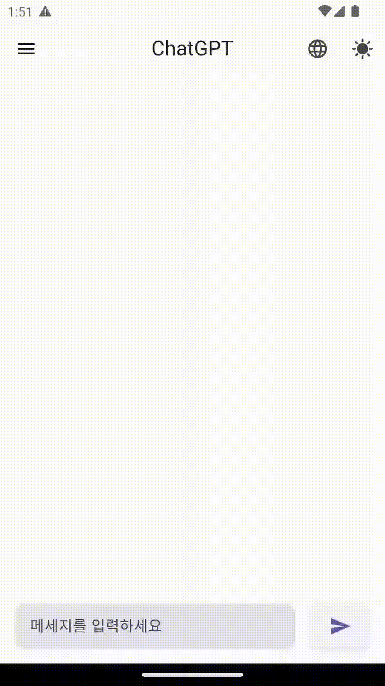
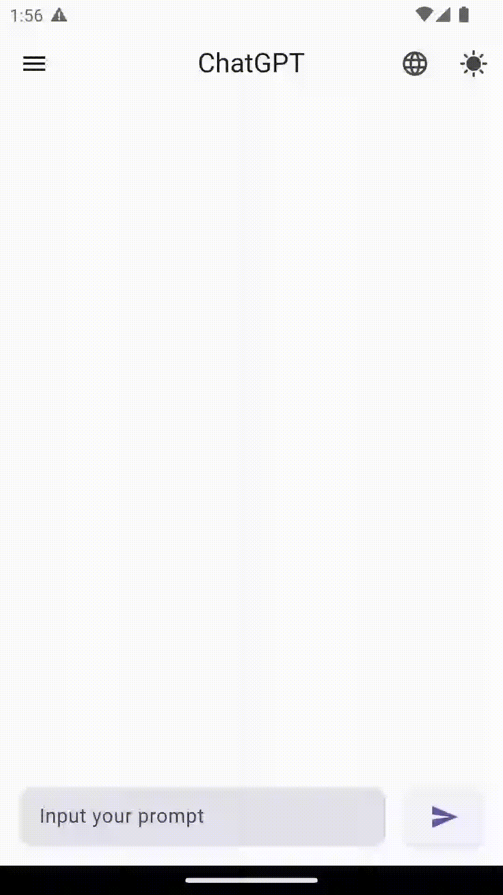

# Flutter ChatGPT

- [지원 기능](#지원-기능)
- [지원 모델](#지원-모델)
- [Dark 모드](#dark-모드)
- [언어 설정](#언어-설정)
- [API Key 입력](#api-key-입력)
- [Completion 기능](#Completion-기능)
- [Chat 기능](#chat-기능)
  - [질문하기](##질문하기)
  - [Code Block](##code-block)

# 지원 기능

- [x] Chat
- [x] Completion

# 지원 모델

- [x] gpt-3.5-turbo
- [x] gpt-3.5-turbo-0301
- [x] text-davinci-003
- [x] text-davinci-002
- [x] text-curie-001
- [x] text-ada-001

# Dark 모드

# 언어 설정

- [x] Korean
- [x] English
- [ ] Japanese

# API Key 입력

> [OpenAI API Keys](https://platform.openai.com/account/api-keys)에서 발급한 API key 입력   > **API key가 일치하지 않을 경우 Model을 선택할 수 없습니다.**

<<<<<<< HEAD

# Completion 기능

https://github.com/song011794/Flutter-chat-box/assets/45446457/177d57c4-1139-4f93-8334-cbf6fea50864

=======

# Chat 기능

> > > > > > > 6925ab4 (docs : 목차 추가)

# Chat 기능

## 질문하기

## Code Block

https://github.com/song011794/Flutter-chat-box/assets/45446457/199792e2-2386-4276-96d9-f5428f24bac1
