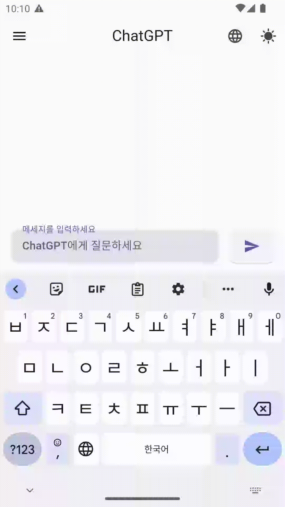

# Flutter ChatGPT

# 지원 모델

- [x] gpt-3.5-turbo
- [x] gpt-3.5-turbo-0301
- [x] text-davinci-003
- [x] text-davinci-002
- [x] text-curie-001
- [x] text-ada-001

# 지원 기능

- [x] Completion
- [x] Chat

# Dark 모드

# 언어 변경

- [x] Korean
- [x] English
- [] Japanese

# API Key 입력

> [OpenAI API Keys](https://platform.openai.com/account/api-keys)에서 발급한 API key 입력
> API key가 일치하지 않을 경우 Model을 선택할 수 없습니다.

<video src="./artificial/chat_cod2.webm" controls="controls" style="max-width: 730px;"/>
